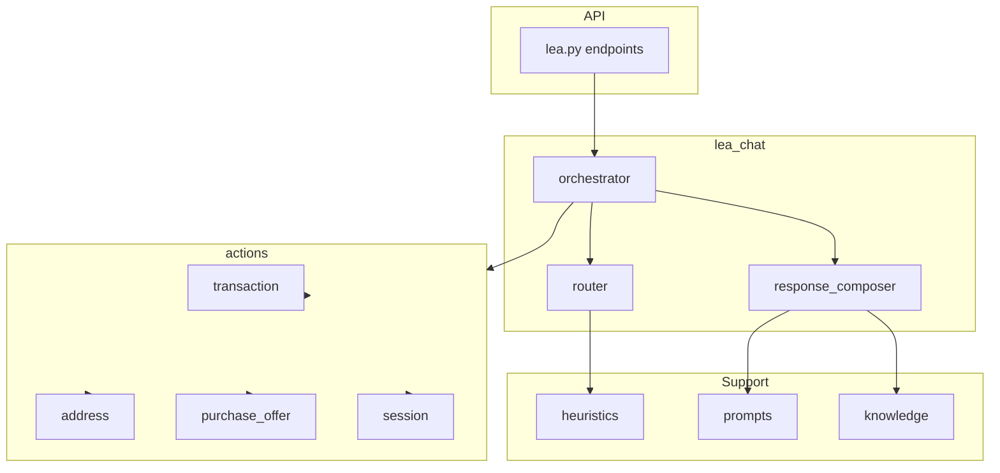

# Plan de refactor – Chat AI Léa

Document de référence pour le refactor du module chat Léa : positionnement produit, scope, architecture cible, schémas, flux, phases et ordre des PRs.

---

## 1. Positionnement de Léa (vision produit)

**Léa est un assistant conversationnel destiné à accompagner les courtiers immobiliers dans leurs tâches quotidiennes.** À terme, il a vocation à assister sur plusieurs workflows métier, incluant notamment la création de transactions, la préparation de promesses d'achat, la gestion de contrats et d'autres actions opérationnelles.

Domaines envisagés pour les phases futures (hors scope actuel) :

- **contracts** — gestion et suivi de contrats
- **forms** — autres formulaires OACIQ (CCVE, DIA, etc.)
- **deadlines** — rappels, dates limites, suivi des échéances
- **client_followup** — suivi clients et prospects
- **compliance** — conformité OACIQ, bonnes pratiques
- **documents** — génération, classement, envoi

**Ce refactor ne porte pas sur l'ensemble de ces capacités.** Il se concentre sur le socle conversationnel initial.

---

## 2. Scope actuel du refactor (périmètre volontairement restreint)

Le présent refactor couvre uniquement le **premier périmètre fonctionnel** :

1. **Création de transaction** — détecter l'intention, collecter les infos, créer le dossier
2. **Création de promesse d'achat** — associer à une transaction, créer le draft PA
3. **Assistance au remplissage de la PA** — guider par section, extraire et sauvegarder les champs

Cette première phase doit poser une **architecture suffisamment propre et modulaire** pour permettre l'ajout futur d'autres capacités métier sans recréer un monolithe. Le design du router (structure domain + intent) et des actions doit donc déjà anticiper l'extensibilité, sans pour autant implémenter ces domaines dès maintenant.

---

## 3. Objectifs

### Fonctionnels

- Comprendre création transaction, création PA, remplissage PA en langage naturel
- Guider la collecte des infos par section (PA)
- Associer la conversation à une transaction active
- Utiliser la connaissance PA existante (LEA_KNOWLEDGE_PA.md, LEA_INSTRUCTION_PA.md)

### Techniques

- Séparer décision, exécution et génération de réponse
- Réduire les heuristiques (LLM en priorité, heuristiques en fallback)
- Rendre le comportement testable
- Extraire la logique hors du monolithe lea.py (~6800 lignes)

---

## 4. Architecture cible (extensible)

L'architecture est conçue pour la phase actuelle (transaction + PA) tout en restant extensible : de nouveaux modules `actions/` et de nouvelles valeurs de `domain` pourront être ajoutés ultérieurement sans refonte majeure.



### Arborescence

```
backend/app/
├── api/v1/endpoints/
│   └── lea.py                      # Endpoints uniquement ; délègue à lea_chat
├── services/
│   └── lea_chat/
│       ├── __init__.py
│       ├── orchestrator.py          # Point d'entrée ; coordonne router + actions + response_composer
│       ├── router.py                # Décision structurée (LLM + fallback heuristique)
│       ├── response_composer.py     # Prépare contexte ; n'appelle pas le LLM
│       ├── knowledge.py             # Charge docs/oaciq/*.md
│       ├── prompts.py               # LEA_SYSTEM_PROMPT, instructions par action
│       ├── schemas.py               # LeaSignals, LeaIntent, ActionResult
│       ├── heuristics.py            # Fallback : _wants_*, _last_message_*, _extract_*
│       └── actions/
│           ├── __init__.py
│           ├── transaction.py       # Création transaction, extraction vendeurs/acheteurs/prix
│           ├── address.py           # Mise à jour adresse, géocodage ; à arbitrer vs transaction
│           ├── purchase_offer.py     # Création PA, remplissage PA, extraction LLM
│           └── session.py           # Liaison session-transaction, contexte conv
```

---

## 5. Responsabilités des modules

| Module | Responsabilité | Sources actuelles |
|--------|----------------|-------------------|
| **router.py** | Comprend le message ; retourne `LeaIntent` (domain + intent + signals). **Aucune écriture DB, aucune logique métier** — décision structurée uniquement. | _classify_lea_intent_llm, _wants_to_create_oaciq_form_for_transaction, _last_message_asked_for_property_for_form, _is_short_confirmation_message |
| **orchestrator.py** | Coordonne router → actions → response_composer ; remplace run_lea_actions. Utilise `confidence` pour trust router vs fallback heuristiques. | lea.py lignes 4636-5402 |
| **response_composer.py** | Prépare le contexte final (system_prompt, user_context, action_lines, knowledge). **Ne fait pas l'appel LLM** — l'endpoint (lea_chat, _stream_lea_sse) effectue l'appel final. Frontière stricte. | _stream_lea_sse, lea_chat, get_lea_user_context, _build_oaciq_form_creation_confirmation |
| **actions/transaction.py** | Créer transaction ; extraire type, adresse, vendeurs, acheteurs, prix. | maybe_create_transaction_from_lea, _wants_to_create_transaction, _extract_sellers_and_buyers_from_creation_message, _extract_price_from_message |
| **actions/address.py** | Mise à jour adresse ; géocodage ; confirmation ville. **Arbitrage avant implémentation :** dans le scope actuel l'adresse sert surtout à créer une transaction et identifier la transaction pour une PA. Garder address.py si logique géocodage/validation est riche ; sinon absorber dans transaction.py au départ. | maybe_update_transaction_address_from_lea, _validate_address_via_geocode, maybe_geocode_existing_transaction_address |
| **actions/purchase_offer.py** | Créer PA ; remplir PA par section ; extraction LLM ; sync vers transaction. | maybe_create_oaciq_form_submission_from_lea, _create_oaciq_form_submission_for_transaction, maybe_oaciq_fill_help_or_save, _extract_pa_fields_llm |
| **actions/session.py** | Lier session-transaction ; récupérer conv, pending, oaciq_fill. | link_lea_session_to_transaction, get_transaction_for_session, get_or_create_lea_conversation |
| **knowledge.py** | Charger LEA_KNOWLEDGE_PA.md, LEA_INSTRUCTION_PA.md, etc. | _load_lea_knowledge_async |
| **heuristics.py** | Fallback quand le router LLM échoue. | _wants_*, _last_message_*, _extract_* |
| **prompts.py** | Prompts système et instructions. | LEA_SYSTEM_PROMPT, blocs d'instructions lea.py |

---

## 6. Schémas (schemas.py)

### Règle d'or du router

**Le router ne fait aucune écriture DB et n'exécute aucune logique métier.** Il retourne uniquement une décision structurée (`LeaIntent`). C'est ce qui évite le mélange des responsabilités et facilite les tests.

### LeaSignals, LeaIntent

Signaux conversationnels typés (extensibilité + lisibilité + autocomplete) :

```python
LeaDomain = Literal["transaction", "purchase_offer", "general_assistance", "other"]
LeaIntentVerb = Literal["create", "fill", "update", "answer", "confirm"]

class LeaSignals(TypedDict, total=False):
    asked_property_for_form: bool   # Dernier msg assistant = demande propriété pour formulaire
    user_confirmed: bool            # Message = confirmation courte (oui, exact, c'est ça)
    user_gave_address: bool         # Message contient une adresse

class LeaIntent(TypedDict, total=False):
    domain: LeaDomain
    intent: LeaIntentVerb
    signals: LeaSignals
    tx_type: Literal["vente", "achat", ""]
    transaction_ref: Optional[str]
    confidence: float
```

**confidence** : utilisé par l'orchestrator pour décider s'il fait confiance au router ou bascule sur les heuristiques. Si `confidence` élevée → suivre le router ; si basse → fallback heuristiques ou chemin conversationnel conservateur.

**Mapping phase actuelle** : création transaction → `domain="transaction"`, `intent="create"` ; création PA → `domain="purchase_offer"`, `intent="create"` ; remplissage PA → `domain="purchase_offer"`, `intent="fill"` ; assistance générale → `domain="general_assistance"`, `intent="answer"`.

### ActionResult

Chaque action backend retourne un `ActionResult` structuré. Contract entre actions et response_composer :

```python
class ActionResult(TypedDict, total=False):
    action_type: str
    success: bool
    action_lines: list[str]
    transaction_id: Optional[int]
    form_submission_id: Optional[int]
    next_step: Optional[str]
    metadata: dict
```

Exemples `action_type` : `"transaction_created"`, `"address_updated"`, `"purchase_offer_created"`, `"purchase_offer_filled"`.

---

## 7. Flux métier (scope phase actuelle)

Tous les flux utilisent `domain` + `intent` (et `signals` si pertinent).

### 7.1 Création de transaction

1. Router détecte `domain="transaction"` + `intent="create"` (LLM ou heuristique)
2. Orchestrator appelle actions.transaction.create_or_collect
3. Si complet : créer RealEstateTransaction, lier session
4. Response_composer prépare action_lines + confirmation ou question suivante
5. Endpoint appelle le LLM pour la réponse finale

### 7.2 Création de PA

- **A** : Message explicite ("créer une PA") → `domain="purchase_offer"` + `intent="create"` → actions.purchase_offer.create
- **B** : Réponse par adresse après "pour quelle propriété ?" → `signals.asked_property_for_form` + `signals.user_gave_address` → bloc adresse + création PA
- **C** : Confirmation courte après "Souhaitez-vous créer la PA pour… ?" → `signals.user_confirmed` → actions.purchase_offer.create

### 7.3 Remplissage PA

1. `conv.context["oaciq_fill"]` présent → `domain="purchase_offer"` + `intent="fill"`
2. actions.purchase_offer.fill : extraction LLM, sauvegarde, prochaine section/champ
3. action_lines : liste des champs ou question unique
4. Response_composer inclut les instructions ("Tu DOIS écrire la liste…")

---

## 8. Fichier de connaissance

Conserver les fichiers existants et les charger via `knowledge.py` :

- docs/oaciq/LEA_KNOWLEDGE_PA.md
- docs/oaciq/LEA_INSTRUCTION_PA.md

Éviter la duplication ; fusionner dans un seul fichier dédié plus tard si besoin.

---

## 9. Plan d'implémentation (6 phases)

### Phase 1 — Refactor structurel (sans changement de comportement)

1. Créer backend/app/services/lea_chat/ et sous-modules
2. Extraire heuristiques dans heuristics.py
3. Extraire actions dans transaction.py, address.py, purchase_offer.py, session.py
4. Créer orchestrator.py qui reproduit la logique de run_lea_actions
5. Créer schemas.py avec LeaSignals, LeaIntent, ActionResult
6. Faire pointer lea.py vers orchestrator.run() ; valider comportements identiques

### Phase 2 — Router centralisé

1. Créer router.py avec compute_intent(message, last_assistant_message, context) -> LeaIntent
2. Implémenter domain + intent + signals ; migrer _classify_lea_intent_llm ; peupler LeaSignals
3. Utiliser le router dans l'orchestrator ; heuristiques en fallback si LLM échoue ; utiliser confidence
4. Tests unitaires du router (mock AIService)

### Phase 3 — Response composer et duplication

1. Créer response_composer.py : build_context(...) -> (system_prompt, user_context, action_lines). **Prépare uniquement** ; l'endpoint reste responsable de l'appel LLM final.
2. Unifier logique de confirmation (transaction créée, PA créé)
3. Unifier session linking dans actions/session.py
4. Déplacer LEA_SYSTEM_PROMPT et instructions dans prompts.py

### Phase 4 — Réduction des heuristiques

1. Remplacer _wants_to_create_oaciq_form_for_transaction par router (domain="purchase_offer", intent="create") + fallback heuristique
2. Remplacer _last_message_asked_for_property_for_form par signals.asked_property_for_form
3. Remplacer _is_short_confirmation_message par signals.user_confirmed
4. Valider cas : "on fait le PA pour 229 dufferin", "c'est ça", "229 rue dufferin"

### Phase 5 — Knowledge et prompts

1. Créer knowledge.py ; charger LEA_KNOWLEDGE_PA.md, LEA_INSTRUCTION_PA.md
2. Injecter via response_composer
3. Vérifier que Léa utilise ces instructions pour le remplissage PA

### Phase 6 — Tests

1. Tests unitaires : router, heuristics, chaque action
2. Tests d'intégration : flux création transaction, création PA, remplissage PA
3. Validation manuelle sur exemples réels
4. Couverture : router, actions, response_composer

### Ordre recommandé des PRs (risque minimum)

1. Créer services/lea_chat/ + schemas.py (LeaSignals, LeaIntent, ActionResult)
2. Extraire actions/session.py
3. Extraire actions/transaction.py
4. Extraire actions/purchase_offer.py
5. Extraire actions/address.py (ou absorber dans transaction selon arbitrage)
6. Créer orchestrator.py avec comportement identique
7. Brancher lea.py sur l'orchestrator
8. Créer router.py
9. Remplacer progressivement les heuristiques
10. Créer response_composer.py
11. Brancher knowledge.py et les fichiers .md

---

## 10. Critères d'acceptation

- Le chat comprend les demandes de création de transaction
- Le chat guide correctement la création
- Le chat comprend les demandes de création de PA (ex. "on fait le PA pour 229 dufferin")
- La PA est liée à la bonne transaction
- Les fichiers .md de connaissance guident les conversations PA
- Le code est découpé en modules
- Les flows principaux sont testables

---

## 11. Contraintes et exclusions

- **Inclus** : chat AI, routing, création transaction, création PA, remplissage PA, connaissance PA
- **Exclu** : refonte DB, modification des modèles, modification des endpoints publics (/chat, /chat/stream), refactor global du backend
- **Préservé** : API LeaChatRequest/LeaChatResponse, structure des action_lines, compatibilité frontend

---

## 12. Risques et mitigations

| Risque | Mitigation |
|--------|-------------|
| Régression sur flows existants | Phase 1 sans changement de comportement ; tests avant/après |
| Latence accrue (appel LLM router) | Un seul appel LLM pour l'intention ; fallback heuristique si échec |
| Migration progressive complexe | Orchestrator appelle le code extrait ; lea.py délègue progressivement |
